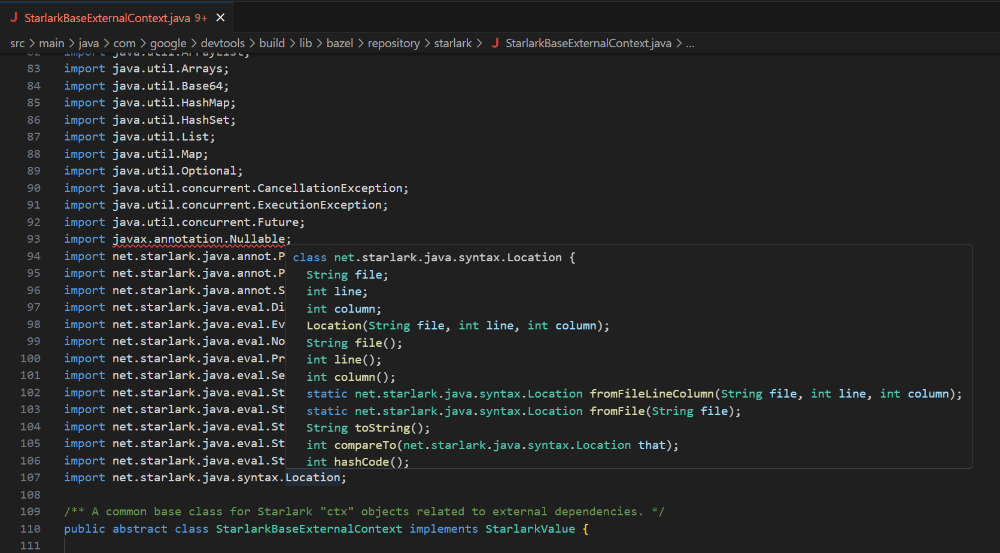
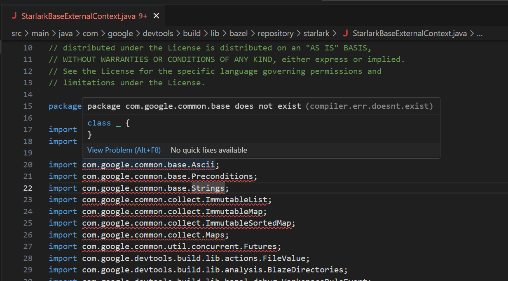

# Language Server for Java

> This is a fork of [George Fraser's](https://github.com/georgewfraser) Java Language Server VSCode extension with;
>
> - Embedded JDK updated from 18 to 21.
> - TextMate grammer replaced with version from [Red Hat's Java Language Support Extension for VSCode](https://github.com/redhat-developer/vscode-java/blob/f09b712f5d6d6339e765f58c8dfab3f78a378183/language-support/java/java.tmLanguage.json).
> - More robust Bazel support.
> - Fixed tests.
> - Updated dependencies.
>
> The focus of this fork is supporting Java alongside Bazel, future releases may drop non-Bazel support in favour of a deeper integration.
>
> This has been tested against Java code in the [Bazel repository](https://github.com/bazelbuild/bazel). _Most_ imports correctly resolve.
>
> **Resolved Import**
> 
>
> **Unresolved Import**
> 

A Java [language server](https://github.com/Microsoft/vscode-languageserver-protocol) based on v3.0 of the protocol and implemented using the [Java compiler API](https://docs.oracle.com/javase/10/docs/api/jdk.compiler-summary.html).

## Installation (VS Code)

[Install from the VS Code marketplace](https://marketplace.visualstudio.com/items?itemName=siliconsoldier.java-lsp)

## [Issues](https://github.com/georgewfraser/java-language-server/issues)

## Features

### Javadoc


### Signature help


### Autocomplete symbols (with auto-import)


### Autocomplete members


### Go-to-definition


### Find symbols


### Lint


### Type information on hover


### Find references


### Debug


## Usage

The language server will provide autocomplete and other features using:
* .java files anywhere in your workspace
* Java platform classes
* External dependencies specified using `pom.xml`, Bazel, or [settings](#Settings)

## Settings

If the language server doesn't detect your external dependencies automatically, you can specify them using [.vscode/settings.json](https://code.visualstudio.com/docs/getstarted/settings)

```json
{
    "java.externalDependencies": [
        "junit:junit:jar:4.12:test", // Maven format
        "junit:junit:4.12" // Gradle-style format is also allowed
    ]
}
```

If all else fails, you can specify the Java class path and the locations of
source jars manually:

```json
{
    "java.classPath": [
        "lib/some-dependency.jar"
    ],
    "java.docPath": [
        "lib/some-dependency-sources.jar"
    ]
}
```

You can generate a list of external dependencies using your build tool:
* Maven: `mvn dependency:list`
* Gradle: `gradle dependencies`

The Java language server will look for the dependencies you specify in `java.externalDependencies` in your Maven and Gradle caches `~/.m2` and `~/.gradle`. You should use your build tool to download the library *and* source jars of all your dependencies so that the Java language server can find them:
* Maven
  * `mvn dependency:resolve` for compilation and autocomplete
  * `mvn dependency:resolve -Dclassifier=sources` for inline Javadoc help
* Gradle
  * `gradle dependencies` for compilation and autocomplete
  * Include `classifier: sources` in your build.gradle for inline Javadoc help, for example:
    ```
    dependencies {
        testCompile group: 'junit', name: 'junit', version: '4.+'
        testCompile group: 'junit', name: 'junit', version: '4.+', classifier: 'sources'
    }
    ```

## Design

The Java language server uses the [Java compiler API](https://docs.oracle.com/javase/10/docs/api/jdk.compiler-summary.html) to implement language features like linting, autocomplete, and smart navigation, and the [language server protocol](https://github.com/Microsoft/vscode-languageserver-protocol) to communicate with text editors like VSCode.

### Incremental updates

The Java compiler API provides incremental compilation at the level of files: you can create a long-lived instance of the Java compiler, and as the user edits, you only need to recompile files that have changed. The Java language server optimizes this further by *focusing* compilation on the region of interest by erasing irrelevant code. For example, suppose we want to provide autocomplete after `print` in the below code:

```java
class Printer {
    void printFoo() {
        System.out.println("foo");
    }
    void printBar() {
        System.out.println("bar");
    }
    void main() {
        print // Autocomplete here
    }
}
```

None of the code inside `printFoo()` and `printBar()` is relevant to autocompleting `print`. Before servicing the autocomplete request, the Java language server erases the contents of these methods:

```java
class Printer {
    void printFoo() {

    }
    void printBar() {

    }
    void main() {
        print // Autocomplete here
    }
}
```

For most requests, the vast majority of code can be erased, dramatically speeding up compilation.

## Logs

The java service process will output a log file to stderr, which is visible in VSCode using View / Output, under "Java".

## Contributing

### Installing

Before installing locally, you need to install prerequisites: npm, maven, protobuf. For example on Mac OS, you can install these using [Brew](https://brew.sh):

    brew install npm maven protobuf

You also need to have [Java 13](https://www.oracle.com/technetwork/java/javase/downloads/index.html) installed. Point the `JAVA_HOME` environment variable to it. For example, on Mac OS:

    export JAVA_HOME=/Library/Java/JavaVirtualMachines/jdk-13.0.1.jdk/Contents/Home/

Assuming you have these prerequisites, you should be able to install locally using:

    npm install -g vsce
    npm install
    ./scripts/build.sh

### Editing

Please run ./configure before your first commit to install a pre-commit hook that formats the code.
