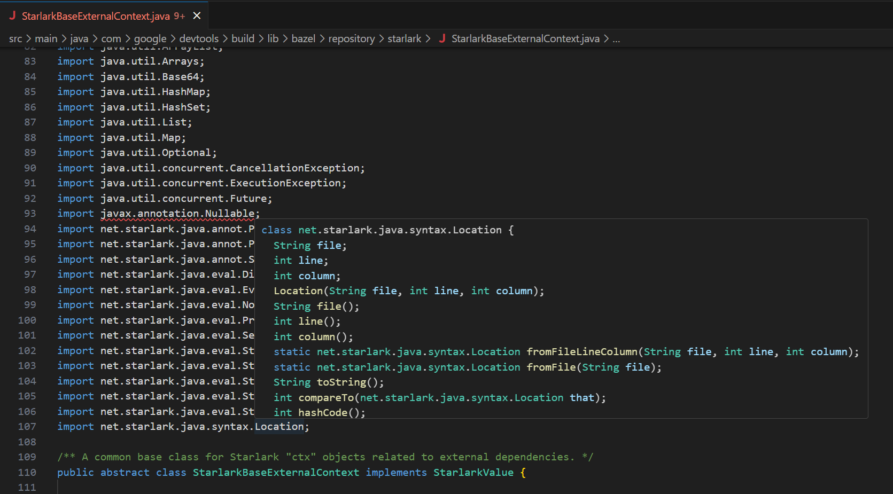

# Java+Bazel Language Support

>  This is a fork of [George Fraser's](https://github.com/georgewfraser) Java Language Server VSCode extension.

A Java [language server](https://github.com/Microsoft/vscode-languageserver-protocol) based on v3.0 of the protocol and implemented using the [Java compiler API](https://docs.oracle.com/javase/10/docs/api/jdk.compiler-summary.html).

This extension is focused on supporting Java alongside Bazel. At present;
- Gracefully handles Bazel analysis failures where possible.
- Supports bzlmod, Bazel's new external dependency management system.

This has been tested against Java code in the [Bazel repository](https://github.com/bazelbuild/bazel). _Most_ imports correctly resolve.

**Resolved Import**


**Unresolved Import**


## Credit

* [George Fraser](https://github.com/georgewfraser), whose [extension](https://marketplace.visualstudio.com/items?itemName=georgewfraser.vscode-javac) this is a fork of.
  - Language Server
  - Debug Server
* [Red Hat](https://github.com/redhat-developer), who maintain their own Java [extension](https://github.com/redhat-developer/vscode-java).
  - Syntax highlighting (textmate grammer)

## Features

### Javadoc


### Signature help


### Autocomplete symbols (with auto-import)


### Autocomplete members


### Go-to-definition


### Find symbols


### Lint


### Type information on hover


### Find references


### Debug


## Settings

If the language server doesn't detect your external dependencies automatically, you can specify them using [.vscode/settings.json](https://code.visualstudio.com/docs/getstarted/settings)

```json
{
    "java.externalDependencies": [
        "junit:junit:jar:4.12:test", // Maven format
        "junit:junit:4.12" // Gradle-style format is also allowed
    ]
}
```

If all else fails, you can specify the Java class path and the locations of
source jars manually:

```json
{
    "java.classPath": [
        "lib/some-dependency.jar"
    ],
    "java.docPath": [
        "lib/some-dependency-sources.jar"
    ]
}
```

You can generate a list of external dependencies using your build tool:
* Maven: `mvn dependency:list`
* Gradle: `gradle dependencies`

The Java language server will look for the dependencies you specify in `java.externalDependencies` in your Maven and Gradle caches `~/.m2` and `~/.gradle`. You should use your build tool to download the library *and* source jars of all your dependencies so that the Java language server can find them:
* Maven
  * `mvn dependency:resolve` for compilation and autocomplete
  * `mvn dependency:resolve -Dclassifier=sources` for inline Javadoc help
* Gradle
  * `gradle dependencies` for compilation and autocomplete
  * Include `classifier: sources` in your build.gradle for inline Javadoc help, for example:
    ```
    dependencies {
        testCompile group: 'junit', name: 'junit', version: '4.+'
        testCompile group: 'junit', name: 'junit', version: '4.+', classifier: 'sources'
    }
    ```
